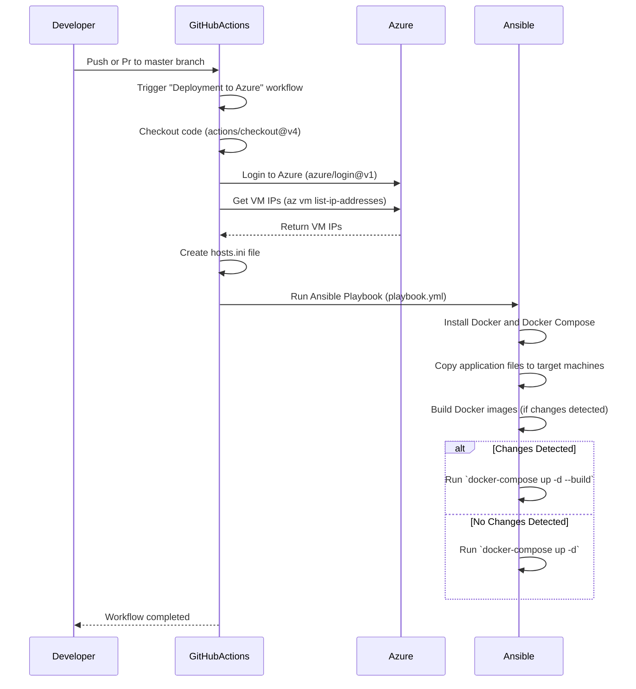

---

### **How This Workflow Works**

1. **Developer Pushes Code**:
   - The workflow is triggered when a developer pushes or pr code to the `master` branch.

2. **GitHub Actions Logs into Azure**:
   - GitHub Actions uses the `azure/login@v1` action to authenticate with Azure.

3. **Retrieve VM IPs**:
   - The workflow retrieves the public IP addresses of the Azure VMs using the `az vm list-ip-addresses` command.

4. **Create `hosts.ini`**:
   - GitHub Actions creates an `hosts.ini` file with the retrieved VM IPs and Ansible credentials.

5. **Run Ansible Playbook**:
   - Ansible connects to the VMs and performs the following tasks:
     - Installs Docker and Docker Compose.
     - Copies application files to the VMs.
     - Builds Docker images (if changes are detected).
     - Runs `docker-compose` to deploy the services.

6. **Workflow Completion**:
   - The workflow completes, and GitHub Actions notifies the developer.

---

### **Alt Cases in the Diagram**

- **Changes Detected**:
  - If Ansible detects changes in the application files (e.g., [todos-api](./todos-api/), [auth-api](./auth-api/), it rebuilds the Docker images and restarts the containers using `docker-compose up -d --build`.

- **No Changes Detected**:
  - If no changes are detected, Ansible skips the rebuild step and simply restarts the containers using `docker-compose up -d`.

---