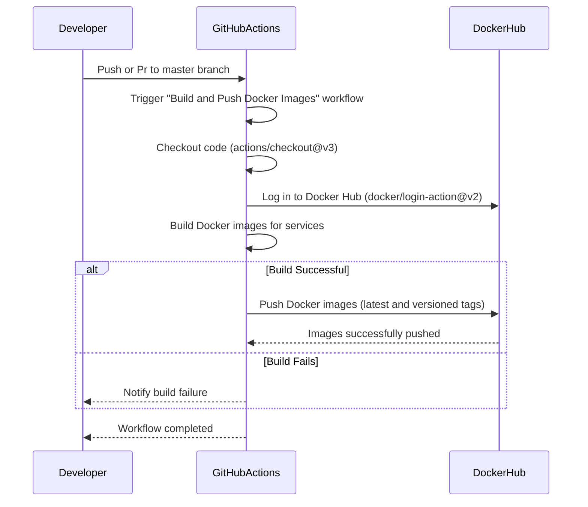

---

### **Explanation of the Diagram**

1. **Developer Pushes Code**:
   - The workflow is triggered when a developer pushes or pr code to the `master` branch or modifies files in specific directories (e.g., `log-message-processor/**`, `todos-api/**`, etc.).

2. **GitHub Actions Workflow**:
   - The workflow starts by checking out the repository code using `actions/checkout@v3`.

3. **Log in to Docker Hub**:
   - GitHub Actions logs into Docker Hub using the `docker/login-action@v2` action with credentials stored in `DOCKER_USERNAME` and `DOCKER_PASSWORD` secrets.

4. **Build Docker Images**:
   - GitHub Actions builds Docker images for the services ([log-message-processor](./log-message-processor/), [todos-api](./todos-api/), [auth-api](./auth-api/), [users-api](./users-api/), [frontend](./frontend/)) using the `docker build` command.
   - Each image is tagged with both `latest` and a versioned tag (e.g., based on the current timestamp).

5. **Push Docker Images**:
   - If the build is successful, GitHub Actions pushes the images to Docker Hub with both `latest` and versioned tags.

6. **Handle Build Failures**:
   - If the build fails, GitHub Actions notifies the developer of the failure.

7. **Workflow Completion**:
   - Once the images are pushed (or the build fails), the workflow completes, and GitHub Actions notifies the developer.

---

### **Alt Cases in the Diagram**

- **Build Successful**:
  - If the Docker images are built successfully, they are pushed to Docker Hub with both `latest` and versioned tags.

- **Build Fails**:
  - If the build fails (e.g., due to a syntax error in the `Dockerfile` or missing dependencies), the workflow stops, and the developer is notified.

---

### **How This Workflow Works**

1. **Trigger**:
   - The workflow is triggered on a push to the `master` branch or changes to specific directories (`log-message-processor/**`, `todos-api/**`, etc.).

2. **Checkout Code**:
   - The repository code is checked out using `actions/checkout@v3`.

3. **Log in to Docker Hub**:
   - GitHub Actions logs into Docker Hub using credentials stored in `DOCKER_USERNAME` and `DOCKER_PASSWORD` secrets.

4. **Build Docker Images**:
   - Docker images are built for the services using the `docker build` command.
   - Each image is tagged with both `latest` and a versioned tag.

5. **Push Docker Images**:
   - The images are pushed to Docker Hub with both `latest` and versioned tags.

6. **Handle Failures**:
   - If the build fails, the workflow stops, and the developer is notified.

---