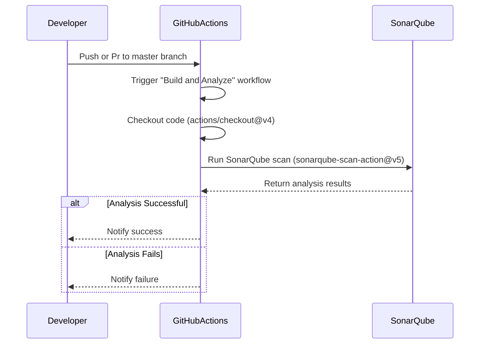

---

### **Explanation of the Diagram**

1. **Developer Pushes Code**:
   - The workflow is triggered when a developer pushes or pr code to the `master` branch or modifies files in the  directory.

2. **GitHub Actions Workflow**:
   - The workflow starts by checking out the repository code using `actions/checkout@v4`.

3. **Run SonarQube Scan**:
   - GitHub Actions runs the SonarQube scan using the `SonarSource/sonarqube-scan-action@v5` action.
   - The `projectBaseDir` is set to the  directory, and the SonarQube server URL and token are provided via secrets (`SONAR_HOST_URL` and `SONAR_TOKEN`).

4. **SonarQube Analysis**:
   - SonarQube analyzes the code for bugs, vulnerabilities, code smells, and other quality issues.

5. **Handle Results**:
   - If the analysis is successful, GitHub Actions notifies the developer of the success.
   - If the analysis fails (e.g., due to quality gate violations), GitHub Actions notifies the developer of the failure.

---

### **Alt Cases in the Diagram**

- **Analysis Successful**:
  - If the SonarQube analysis passes all quality gates, the workflow completes successfully, and the developer is notified.

- **Analysis Fails**:
  - If the analysis fails (e.g., due to quality gate violations), the workflow stops, and the developer is notified of the failure.

---

### **How This Workflow Works**

1. **Trigger**:
   - The workflow is triggered on a push to the `master` branch or changes to the  directory.

2. **Checkout Code**:
   - The repository code is checked out using `actions/checkout@v4`.

3. **Run SonarQube Scan**:
   - The SonarQube scan is run using the `SonarSource/sonarqube-scan-action@v5` action.
   - The `projectBaseDir` is set to , and the SonarQube server URL and token are provided via secrets.

4. **Handle Results**:
   - If the analysis is successful, the workflow completes, and the developer is notified.
   - If the analysis fails, the workflow stops, and the developer is notified of the failure.

---

